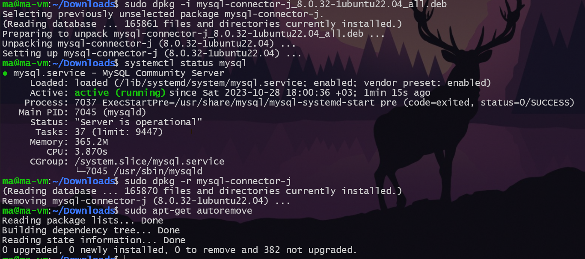

### Операционные системы и виртуализация (Linux)

1. Использование команды cat в Linux
   - Создать два текстовых файла: `Pets` (Домашние животные) и `Pack animals` (вьючные животные), используя команду `cat` в терминале Linux. В первом файле перечислить собак, кошек и хомяков. Во втором — лошадей, верблюдов и ослов.
    ``` bash
    $ nano Pets
    $ cat Pets
    | Fido     | Dog     | 2020-01-01 |
    | Whiskers | Cat     | 2019-05-15 |
    | Hammy    | Hamster | 2021-03-10 |
    | Buddy    | Dog     | 2018-12-10 |
    | Smudge   | Cat     | 2020-02-20 |
    | Peanut   | Hamster | 2021-08-01 |
    | Bella    | Dog     | 2019-11-11 |
    | Oliver   | Cat     | 2020-06-30 |
    $ nano 'Pack animals'
    $ cat 'Pack animals'
    | Thunder  | Horse   | 2015-07-21 |
    | Sandy    | Camel   | 2016-11-03 |
    | Eeyore   | Donkey  | 2017-09-18 |
    | Storm    | Horse   | 2014-05-05 |
    | Dune     | Camel   | 2018-12-12 |
    | Burro    | Donkey  | 2019-01-23 |
    | Blaze    | Horse   | 2016-02-29 |
    | Sahara   | Camel   | 2015-08-14 |
    ```
   
    
   - Объединить содержимое этих двух файлов в один и просмотреть его содержимое.
   ```bash
    $ cat Pets 'Pack animals' > animals
    $ cat animals
        | Fido     | Dog     | 2020-01-01 |
        | Whiskers | Cat     | 2019-05-15 |
        | Hammy    | Hamster | 2021-03-10 |
        | Buddy    | Dog     | 2018-12-10 |
        | Smudge   | Cat     | 2020-02-20 |
        | Peanut   | Hamster | 2021-08-01 |
        | Bella    | Dog     | 2019-11-11 |
        | Oliver   | Cat     | 2020-06-30 |
        | Thunder  | Horse   | 2015-07-21 |
        | Sandy    | Camel   | 2016-11-03 |
        | Eeyore   | Donkey  | 2017-09-18 |
        | Storm    | Horse   | 2014-05-05 |
        | Dune     | Camel   | 2018-12-12 |
        | Burro    | Donkey  | 2019-01-23 |
        | Blaze    | Horse   | 2016-02-29 |
        | Sahara   | Camel   | 2015-08-14 |
   ```
   
   - Переименовать получившийся файл в `Human Friends`.
   ```bash
    $ mv animals `Human Friends`
   ```
    
2. Работа с директориями в Linux
   - Создать новую директорию и переместить туда файл "Human Friends".
    ```bash
    mkdir directory
    mv 'Human friends' directory
    ```
    
3. Работа с MySQL в Linux. “Установить MySQL на вашу вычислительную машину ”
   - Подключить дополнительный репозиторий MySQL и установить один из пакетов из этого репозитория.
   ```bash
   sudo apt install mysql-server -y
   ....
   systemctl status mysql
   mysql.service - MySQL Community Server
        Loaded: loaded (/lib/systemd/system/mysql.service; enabled; vendor preset: enabled)
        Active: active (running) since Sat 2023-10-28 17:50:27 +03; 30s ago
    Process: 5948 ExecStartPre=/usr/share/mysql/mysql-systemd-start pre (code=exited, status=0/SUCCESS)
   Main PID: 5956 (mysqld)
        Status: "Server is operational"
        Tasks: 38 (limit: 9447)
        Memory: 365.3M
        CPU: 3.557s
        CGroup: /system.slice/mysql.service
                └─5956 /usr/sbin/mysqld
   ```

4. Управление deb-пакетами
   - Установить и затем удалить deb-пакет, используя команду `dpkg`.
    
5. История команд в терминале Ubuntu
   - Сохранить и выложить историю ваших терминальных команд в Ubuntu.
    

