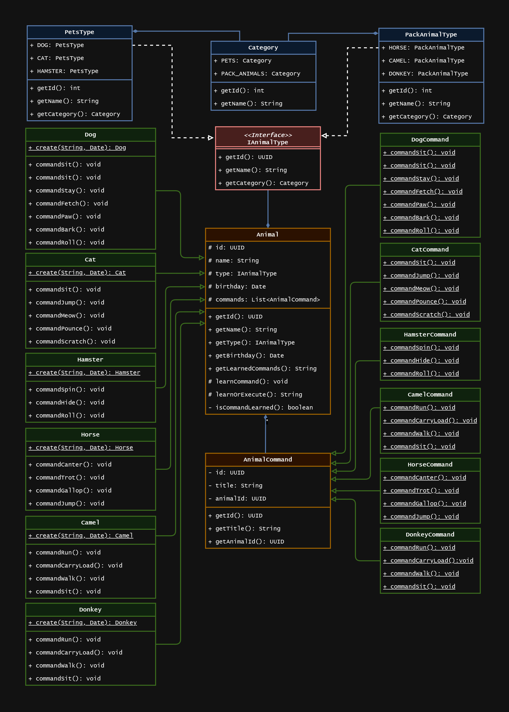
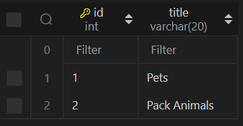
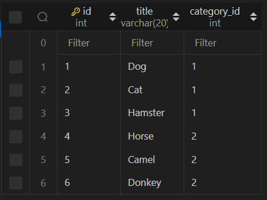
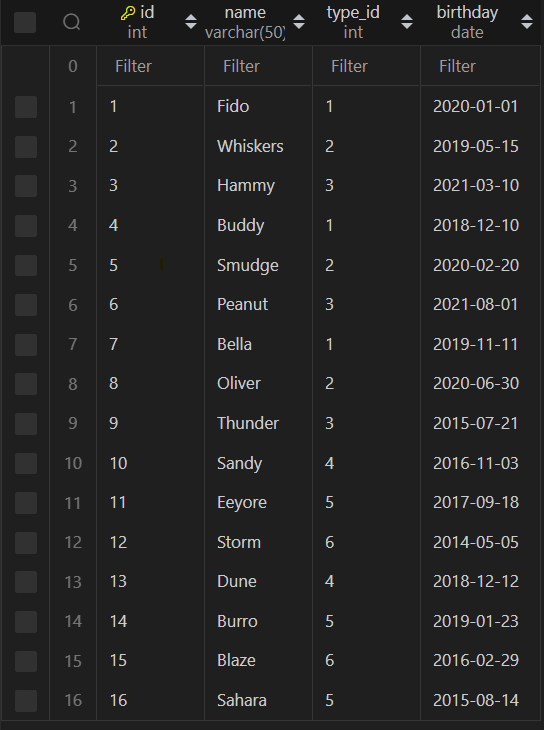
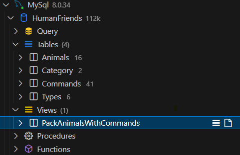
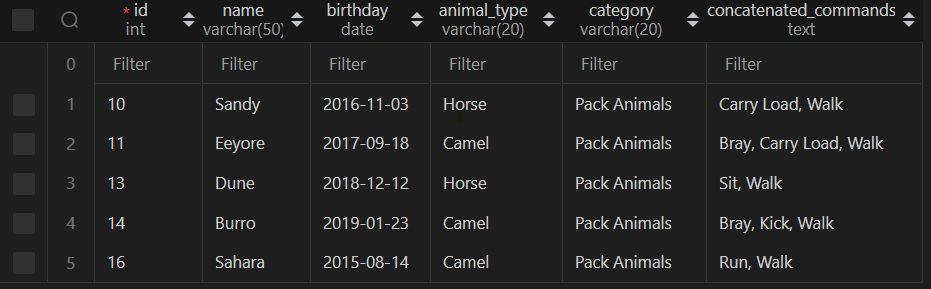
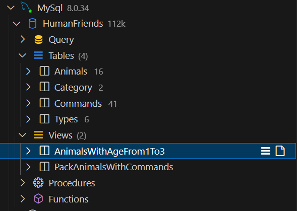
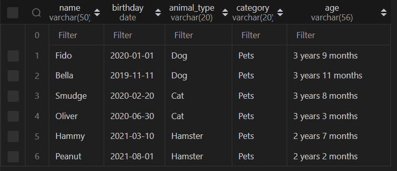

## Объектно-ориентированное программирование 

### 6. Диаграмма классов
> Создать диаграмму классов с родительским классом "Животные", и двумя подклассами: "Pets" и "Pack animals". В составы классов которых в случае Pets войдут классы: собаки, кошки, хомяки, а в класс Pack animals войдут: Лошади, верблюды и ослы. Каждый тип животных будет характеризоваться (например, имена, даты рождения, выполняемые команды и т.д). Диаграмму можно нарисовать в любом редакторе.

 

### 7. Работа с MySQL 
> После создания диаграммы классов в 6 пункте, в 7 пункте база данных "Human Friends" должна быть структурирована в соответствии с этой диаграммой.    


```sql
/* creating database */
DROP DATABASE IF EXISTS HumanFriends;
CREATE DATABASE IF NOT EXISTS HumanFriends;     
```
```sql
/* creating table `Category`*/
USE HumanFriends;

DROP TABLE IF EXISTS `Category`;
CREATE TABLE IF NOT EXISTS `Category`(
    `id` INT AUTO_INCREMENT PRIMARY KEY,
    `title` VARCHAR(20)
);

INSERT INTO `Category`(`title`)
VALUES
    ("Pets"),
    ("Pack Animals");   
```


```sql
/* creating table `Types`*/

USE HumanFriends;

DROP TABLE IF EXISTS `Types`;
CREATE TABLE IF NOT EXISTS `Types`(
    `id` INT AUTO_INCREMENT PRIMARY KEY,
    `title` VARCHAR(20),
    `category_id` INT,
    CONSTRAINT fk_category FOREIGN KEY(`category_id`) REFERENCES `Category`(`id`)
);

INSERT INTO `Types`(`title`, `category_id`)
VALUES
    ("Dog", 1),
    ("Cat", 1),
    ("Hamster", 1),
    ("Horse", 2),
    ("Camel", 2),
    ("Donkey", 2);   
```

```sql
/* creating table `Animals`*/
USE HumanFriends;
DROP TABLE IF EXISTS `Animals`;

CREATE TABLE IF NOT EXISTS `Animals`(
    `id` INT AUTO_INCREMENT PRIMARY KEY,
    `name` VARCHAR(50),
    `type_id` int,
    `birthday` DATE,
    CONSTRAINT fk_type Foreign Key (`type_id`) REFERENCES `Types`(`id`)
);
INSERT INTO `Animals`(`name`, `type_id`, `birthday`)
VALUES ("Fido", 1, "2020-01-01"),
    ("Whiskers", 2, "2019-05-15"),
    ("Hammy", 3, "2021-03-10"),
    ("Buddy", 1, "2018-12-10"),
    ("Smudge", 2, "2020-02-20"),
    ("Peanut", 3, "2021-08-01"),
    ("Bella", 1, "2019-11-11"),
    ("Oliver", 2, "2020-06-30"),
    ("Thunder", 3, "2015-07-21"),
    ("Sandy", 4, "2016-11-03"),
    ("Eeyore", 5, "2017-09-18"),
    ("Storm", 6, "2014-05-05"),
    ("Dune", 4, "2018-12-12"),
    ("Burro", 5, "2019-01-23"),
    ("Blaze", 6, "2016-02-29"),
    ("Sahara", 5, "2015-08-14");  
```


```sql
/* creating table `Commands`*/
USE HumanFriends;
DROP TABLE IF EXISTS `Commands`;

CREATE TABLE IF NOT EXISTS `Commands`(
    `id` INT AUTO_INCREMENT PRIMARY KEY,
    `name` VARCHAR(50),
    `animal_id` int,
    CONSTRAINT fk_animal Foreign Key (`animal_id`) REFERENCES `Animals`(`id`)
);
INSERT INTO `Commands`(`name`, `animal_id`)
VALUES 
    ("Sit", 1), ("Stay", 1), ("Fetch", 1),
    ("Sit", 2), ("Pounce", 2),
    ("Roll", 3), ("Hide", 3),
    ("Sit", 4), ("Paw", 4), ("Bark", 4),
    ("Sit", 5), ("Pounce", 5), ("Scratch", 5),
    ("Roll", 6), ("Spin", 6),
    ("Sit", 7), ("Stay", 7), ("Roll", 7),
    ("Meow", 8), ("Scratch", 8), ("Jump", 8),
    ("Trot", 9), ("Canter", 9), ("Gallop", 9),
    ("Walk", 10), ("Carry Load", 10),
    ("Walk", 11), ("Carry Load", 11), ("Bray", 11),
    ("Trot", 12), ("Canter", 12),
    ("Walk", 13), ("Sit", 13),
    ("Walk", 14), ("Bray", 14), ("Kick", 14),
    ("Trot", 15), ("Jump", 15), ("Gallop", 15),
    ("Walk", 16), ("Run", 16);
```
> - объединить таблицы лошадей и ослов без верблюдов

```sql
USE `HumanFriends`;

CREATE VIEW PackAnimalsWithCommands AS
SELECT 
    a.id,
    a.name,
    a.birthday,
    t.title AS animal_type,
    c.title AS category,
    GROUP_CONCAT(cm.name ORDER BY cm.name ASC SEPARATOR ', ') AS concatenated_commands
FROM `Animals` AS a
LEFT JOIN `Types` AS t ON t.id = a.type_id
JOIN `Category` AS c ON t.category_id = c.id
LEFT JOIN `Commands` AS cm ON cm.animal_id = a.id
WHERE c.title = "Pack Animals" AND (t.title = "Horse" OR t.title = "Camel")
GROUP BY a.id, a.name, a.birthday, t.title, c.title;

```



> - Создать новую таблицу для животных в возрасте от 1 до 3 лет и вычислить их возраст с точностью до месяца.
```sql
USE `HumanFriends`;
CREATE VIEW AnimalsWithAgeFrom1To3 AS
SELECT
    a.`name`,
    a.`birthday`,
    t.title AS animal_type,
    c.title AS category,
    CONCAT(
        TIMESTAMPDIFF(YEAR, a.`birthday`, CURDATE()),
        ' years ',
        TIMESTAMPDIFF(MONTH, a.`birthday`, CURDATE()) % 12,
        ' months'
    ) AS `age`
FROM `Animals` as a
LEFT JOIN `Types` AS t ON t.id = a.type_id
JOIN `Category` AS c ON t.category_id = c.id
WHERE TIMESTAMPDIFF(YEAR, a.`birthday`, CURDATE()) BETWEEN 1 AND 3;
```




> - Объединить все созданные таблицы в одну, сохраняя информацию о принадлежности к исходным таблицам

```sql
USE `HumanFriends`;

SELECT 
    a.id,
    a.name,
    CONCAT(
        TIMESTAMPDIFF(YEAR, a.`birthday`, CURDATE()),
        ' years ',
        TIMESTAMPDIFF(MONTH, a.`birthday`, CURDATE()) % 12,
        ' months'
    ) AS `age`,
    t.title AS animal_type,
    c.title AS category,
    GROUP_CONCAT(cm.name ORDER BY cm.name ASC SEPARATOR ', ') AS concatenated_commands
FROM `Animals` AS a
LEFT JOIN `Types` AS t ON t.id = a.type_id
JOIN `Category` AS c ON t.category_id = c.id
LEFT JOIN `Commands` AS cm ON cm.animal_id = a.id
GROUP BY a.id, a.name, a.birthday, t.title, c.title
ORDER BY `age`;
```
