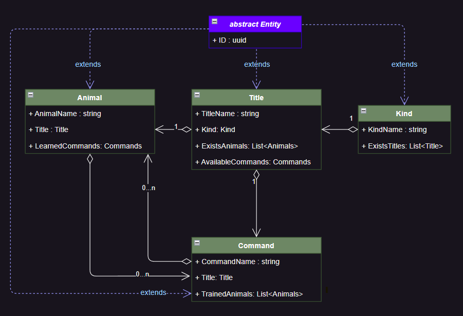
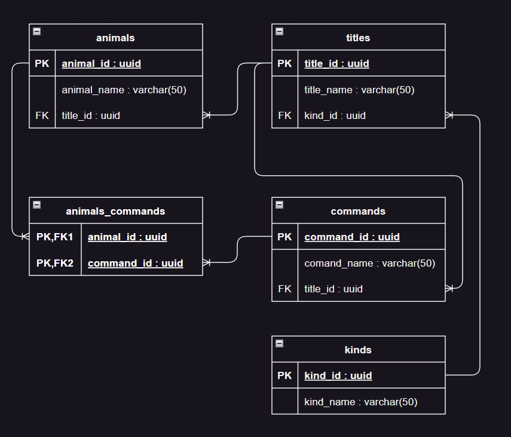
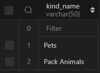
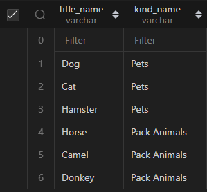
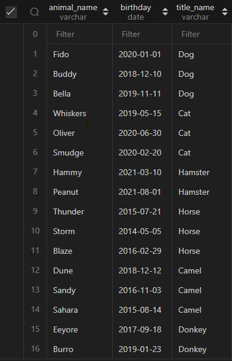
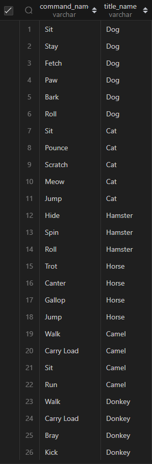
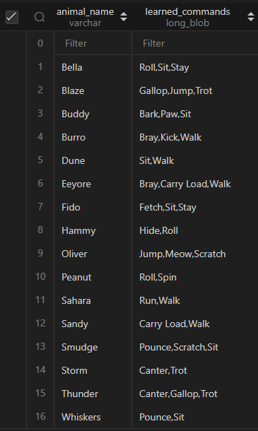
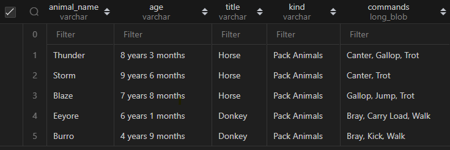
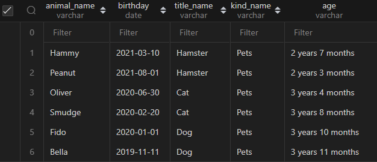
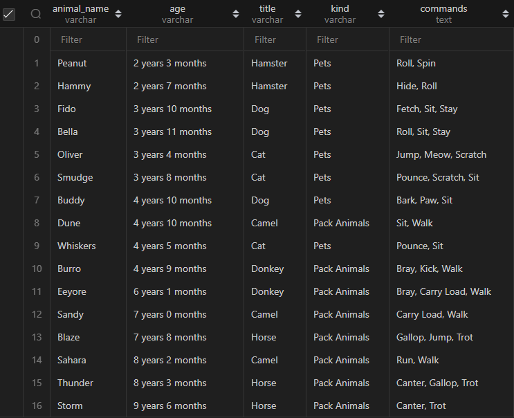

## Объектно-ориентированное программирование 

### 6. Диаграмма классов
> Создать диаграмму классов с родительским классом "Животные", и двумя подклассами: "Pets" и "Pack animals". В составы классов которых в случае Pets войдут классы: собаки, кошки, хомяки, а в класс Pack animals войдут: Лошади, верблюды и ослы. Каждый тип животных будет характеризоваться (например, имена, даты рождения, выполняемые команды и т.д). Диаграмму можно нарисовать в любом редакторе.
## Схема доменных моделей
 

### 7. Работа с MySQL 
> После создания диаграммы классов в 6 пункте, в 7 пункте база данных "Human Friends" должна быть структурирована в соответствии с этой диаграммой.    

## Схема базы данных


## Создание таблиц

### 1. Создание базы данных `HumanFriends`
```sql
DROP DATABASE IF EXISTS HumanFriends;
CREATE DATABASE IF NOT EXISTS HumanFriends;
```


### 2. Создание таблицы для хранения категорий животных `Kinds`
```sql
DROP TABLE IF EXISTS `Kinds`;
CREATE TABLE IF NOT EXISTS `Kinds`(
    `kind_id` char(36) PRIMARY KEY,
    `kind_name` VARCHAR(50)
);
INSERT INTO `Kinds`(`kind_id`, `kind_name`)
VALUES
    (UUID(), "Pets"),
    (UUID(), "Pack Animals");
```
проверяем результат
```sql
SELECT `kind_name` FROM `Kinds`;
```



### 3. Создание таблицы для хранения наименований животных `Titles`
```sql
DROP TABLE IF EXISTS `Titles`;
CREATE TABLE IF NOT EXISTS `Titles`(
    `title_id`      CHAR(36) PRIMARY KEY,
    `title_name`    VARCHAR(20),
    `kind_id`       CHAR(36),
    CONSTRAINT fk_kind FOREIGN KEY(`kind_id`) REFERENCES `Kinds`(`kind_id`) ON DELETE CASCADE
);
INSERT INTO `Titles`(`title_id`, `title_name`, `kind_id`)
VALUES
    (UUID(), "Dog",     (SELECT `kind_id` FROM `Kinds` WHERE `kind_name` = "Pets")),
    (UUID(), "Cat",     (SELECT `kind_id` FROM `Kinds` WHERE `kind_name` = "Pets")),
    (UUID(), "Hamster", (SELECT `kind_id` FROM `Kinds` WHERE `kind_name` = "Pets")),
    (UUID(), "Horse",   (SELECT `kind_id` FROM `Kinds` WHERE `kind_name` = "Pack Animals")),
    (UUID(), "Camel",   (SELECT `kind_id` FROM `Kinds` WHERE `kind_name` = "Pack Animals")),
    (UUID(), "Donkey",  (SELECT `kind_id` FROM `Kinds` WHERE `kind_name` = "Pack Animals")); 
    
```
проверяем результат
```sql
SELECT  
    t.`title_name`,
    k.`kind_name`
FROM `Titles` AS t
JOIN `Kinds` AS k ON t.`kind_id` = k.`kind_id`;
```



### 4. Создание таблицы для хранения конкретных животных `Animals`
```sql
DROP TABLE IF EXISTS `Animals`;
CREATE TABLE IF NOT EXISTS `Animals`(
    `animal_id` CHAR(36) PRIMARY KEY,
    `animal_name` VARCHAR(50),
    `birthday` DATE,
    `title_id` CHAR(36),
    CONSTRAINT fk_title_of_animal Foreign Key (`title_id`) REFERENCES `Titles`(`title_id`) ON DELETE CASCADE
);
INSERT INTO `Animals`(`animal_id`, `animal_name`, `birthday`, `title_id`)
VALUES 
    (UUID(), "Fido",     "2020-01-01", (SELECT title_id FROM Titles WHERE `title_name` = "Dog")),
    (UUID(), "Buddy",    "2018-12-10", (SELECT title_id FROM Titles WHERE `title_name` = "Dog")),
    (UUID(), "Bella",    "2019-11-11", (SELECT title_id FROM Titles WHERE `title_name` = "Dog")),
    (UUID(), "Whiskers", "2019-05-15", (SELECT title_id FROM Titles WHERE `title_name` = "Cat")),
    (UUID(), "Oliver",   "2020-06-30", (SELECT title_id FROM Titles WHERE `title_name` = "Cat")),
    (UUID(), "Smudge",   "2020-02-20", (SELECT title_id FROM Titles WHERE `title_name` = "Cat")),
    (UUID(), "Hammy",    "2021-03-10", (SELECT title_id FROM Titles WHERE `title_name` = "Hamster")),
    (UUID(), "Peanut",   "2021-08-01", (SELECT title_id FROM Titles WHERE `title_name` = "Hamster")),
    (UUID(), "Thunder",  "2015-07-21", (SELECT title_id FROM Titles WHERE `title_name` = "Horse")),
    (UUID(), "Storm",    "2014-05-05", (SELECT title_id FROM Titles WHERE `title_name` = "Horse")),
    (UUID(), "Blaze",    "2016-02-29", (SELECT title_id FROM Titles WHERE `title_name` = "Horse")),
    (UUID(), "Eeyore",   "2017-09-18", (SELECT title_id FROM Titles WHERE `title_name` = "Donkey")),
    (UUID(), "Burro",    "2019-01-23", (SELECT title_id FROM Titles WHERE `title_name` = "Donkey")),
    (UUID(), "Dune",     "2018-12-12", (SELECT title_id FROM Titles WHERE `title_name` = "Camel")),
    (UUID(), "Sandy",    "2016-11-03", (SELECT title_id FROM Titles WHERE `title_name` = "Camel")),
    (UUID(), "Sahara",   "2015-08-14", (SELECT title_id FROM Titles WHERE `title_name` = "Camel"));
    
```
проверяем результат
```sql
SELECT a.animal_name, a.birthday, t.title_name
FROM `Animals` AS a
JOIN `Titles` AS t ON t.title_id = a.title_id;
```



### 5. Создание таблицы для хранения доступных команд `Commands`
```sql
DROP TABLE IF EXISTS `Commands`;

CREATE TABLE IF NOT EXISTS `Commands`(
    `command_id` CHAR(36) PRIMARY KEY,
    `command_name` VARCHAR(50),
    `title_id` CHAR(36),
    CONSTRAINT fk_available_command Foreign Key (`title_id`) REFERENCES `Titles`(`title_id`) ON DELETE CASCADE
);
INSERT INTO `Commands`(`command_id`, `command_name`, `title_id`)
VALUES 
    (UUID(), "Sit",        (SELECT `title_id` FROM Titles WHERE `title_name` = "Dog")),
    (UUID(), "Stay",       (SELECT `title_id` FROM Titles WHERE `title_name` = "Dog")),
    (UUID(), "Fetch",      (SELECT `title_id` FROM Titles WHERE `title_name` = "Dog")),
    (UUID(), "Paw",        (SELECT `title_id` FROM Titles WHERE `title_name` = "Dog")),
    (UUID(), "Bark",       (SELECT `title_id` FROM Titles WHERE `title_name` = "Dog")),
    (UUID(), "Roll",       (SELECT `title_id` FROM Titles WHERE `title_name` = "Dog")),
    (UUID(), "Sit",        (SELECT `title_id` FROM Titles WHERE `title_name` = "Cat")),
    (UUID(), "Pounce",     (SELECT `title_id` FROM Titles WHERE `title_name` = "Cat")),
    (UUID(), "Scratch",    (SELECT `title_id` FROM Titles WHERE `title_name` = "Cat")),
    (UUID(), "Meow",       (SELECT `title_id` FROM Titles WHERE `title_name` = "Cat")),
    (UUID(), "Jump",       (SELECT `title_id` FROM Titles WHERE `title_name` = "Cat")),
    (UUID(), "Hide",       (SELECT `title_id` FROM Titles WHERE `title_name` = "Hamster")),
    (UUID(), "Spin",       (SELECT `title_id` FROM Titles WHERE `title_name` = "Hamster")),
    (UUID(), "Roll",       (SELECT `title_id` FROM Titles WHERE `title_name` = "Hamster")),
    (UUID(), "Trot",       (SELECT `title_id` FROM Titles WHERE `title_name` = "Horse")),
    (UUID(), "Canter",     (SELECT `title_id` FROM Titles WHERE `title_name` = "Horse")),
    (UUID(), "Gallop",     (SELECT `title_id` FROM Titles WHERE `title_name` = "Horse")),
    (UUID(), "Jump",       (SELECT `title_id` FROM Titles WHERE `title_name` = "Horse")),
    (UUID(), "Walk",       (SELECT `title_id` FROM Titles WHERE `title_name` = "Camel")),
    (UUID(), "Carry Load", (SELECT `title_id` FROM Titles WHERE `title_name` = "Camel")),
    (UUID(), "Sit",        (SELECT `title_id` FROM Titles WHERE `title_name` = "Camel")),
    (UUID(), "Run",        (SELECT `title_id` FROM Titles WHERE `title_name` = "Camel")),
    (UUID(), "Walk",       (SELECT `title_id` FROM Titles WHERE `title_name` = "Donkey")),
    (UUID(), "Carry Load", (SELECT `title_id` FROM Titles WHERE `title_name` = "Donkey")),
    (UUID(), "Bray",       (SELECT `title_id` FROM Titles WHERE `title_name` = "Donkey")),
    (UUID(), "Kick",       (SELECT `title_id` FROM Titles WHERE `title_name` = "Donkey"));
    
```
проверяем результат
```sql
SELECT c.`command_name`, t.`title_name`
FROM `Commands` AS c
JOIN `Titles` AS t ON t.`title_id` = c.`title_id`;
```



### 6. Создание таблицы для хранения обученных животных и выученных команд `AnimalLearnedCommands`
```sql
DROP TABLE IF EXISTS `AnimalLearnedCommands`;
CREATE TABLE IF NOT EXISTS `AnimalLearnedCommands` (
    `command_id` CHAR(36),
    `animal_id` CHAR(36),
    PRIMARY KEY (`command_id`, `animal_id`),
    CONSTRAINT `fk_learned_command` FOREIGN KEY (`command_id`) REFERENCES `Commands` (`command_id`) ON DELETE CASCADE,
    CONSTRAINT `fk_trained_animal` FOREIGN KEY (`animal_id`) REFERENCES `Animals` (`animal_id`) ON DELETE CASCADE
);    
```
для заполнения создана процедура `AnimalTraining`
```sql
-- procedure for fill table
DELIMITER //
CREATE PROCEDURE AnimalTraining(
    IN animalTitle VARCHAR(255),
    IN commandName VARCHAR(255),
    IN animalName VARCHAR(255)
)
BEGIN
    DECLARE animalId CHAR(36);
    DECLARE commandId CHAR(36);

    -- Find the animal_id based on the animalName
    SELECT `animal_id` INTO animalId FROM `Animals` WHERE `animal_name` = animalName;

    -- Find the command_id based on the commandName and animalTitle
    SELECT c.`command_id` INTO commandId
    FROM `Commands` c 
    JOIN `Titles` t ON c.title_id = t.title_id
    WHERE c.`command_name` = commandName AND t.`title_name` = animalTitle;

    -- Insert the learned command into the AnimalLearnedCommands table
    INSERT INTO `AnimalLearnedCommands` (`command_id`, `animal_id`)
    VALUES (commandId, animalId);
END //
DELIMITER ;
```
заполнение
```sql
CALL `AnimalTraining`("Dog", "Sit", "Fido");
CALL `AnimalTraining`("Dog", "Stay", "Fido");
CALL `AnimalTraining`("Dog", "Fetch", "Fido");

CALL `AnimalTraining`("Dog", "Sit", "Buddy");
CALL `AnimalTraining`("Dog", "Paw", "Buddy");
CALL `AnimalTraining`("Dog", "Bark", "Buddy");

CALL `AnimalTraining`("Dog", "Sit", "Bella");
CALL `AnimalTraining`("Dog", "Stay", "Bella");
CALL `AnimalTraining`("Dog", "Roll", "Bella");

CALL `AnimalTraining`("Cat", "Sit", "Whiskers");
CALL `AnimalTraining`("Cat", "Pounce", "Whiskers");

CALL `AnimalTraining`("Cat", "Sit", "Smudge");
CALL `AnimalTraining`("Cat", "Pounce", "Smudge");
CALL `AnimalTraining`("Cat", "Scratch", "Smudge");

CALL `AnimalTraining`("Cat", "Meow", "Oliver");
CALL `AnimalTraining`("Cat", "Scratch", "Oliver");
CALL `AnimalTraining`("Cat", "Jump", "Oliver");

CALL `AnimalTraining`("Hamster", "Roll", "Hammy");
CALL `AnimalTraining`("Hamster", "Hide", "Hammy");

CALL `AnimalTraining`("Hamster", "Roll", "Peanut");
CALL `AnimalTraining`("Hamster", "Spin", "Peanut");

CALL `AnimalTraining`("Horse", "Trot", "Thunder");
CALL `AnimalTraining`("Horse", "Canter", "Thunder");
CALL `AnimalTraining`("Horse", "Gallop", "Thunder");

CALL `AnimalTraining`("Horse", "Trot", "Storm");
CALL `AnimalTraining`("Horse", "Canter", "Storm");

CALL `AnimalTraining`("Horse", "Trot", "Blaze");
CALL `AnimalTraining`("Horse", "Jump", "Blaze");
CALL `AnimalTraining`("Horse", "Gallop", "Blaze");

CALL `AnimalTraining`("Camel", "Walk", "Sandy");
CALL `AnimalTraining`("Camel", "Carry Load", "Sandy");

CALL `AnimalTraining`("Camel", "Walk", "Dune");
CALL `AnimalTraining`("Camel", "Sit", "Dune");

CALL `AnimalTraining`("Camel", "Walk", "Sahara");
CALL `AnimalTraining`("Camel", "Run", "Sahara");

CALL `AnimalTraining`("Donkey", "Walk", "Eeyore");
CALL `AnimalTraining`("Donkey", "Carry Load", "Eeyore");
CALL `AnimalTraining`("Donkey", "Bray", "Eeyore");

CALL `AnimalTraining`("Donkey", "Walk", "Burro");
CALL `AnimalTraining`("Donkey", "Bray", "Burro");
CALL `AnimalTraining`("Donkey", "Kick", "Burro");
```

проверяем результат
```sql
SELECT a.`animal_name`, GROUP_CONCAT(c.`command_name` ORDER BY c.`command_name`) AS `learned_commands`
FROM `AnimalLearnedCommands` as ac
JOIN `Commands` c ON c.`command_id` = ac.`command_id`
JOIN `Animals` a ON a.`animal_id` = ac.`animal_id`
GROUP BY a.`animal_name``;
```


##  Удалить записи о верблюдах и объединить таблицы лошадей и ослов.

### 1. Удаление записей о верблюдах

```sql
    DELETE FROM `Animals` AS a
    JOIN `Titles` t ON t.`title_id` = a.`title_id`
    WHERE `title_name` = `Camel`; 
```
### 2. Объединить лошадей и ослов.

```sql
SELECT 
    a.`animal_name`,
    CONCAT(
        TIMESTAMPDIFF(YEAR, a.`birthday`, CURDATE()),
        ' years ',
        TIMESTAMPDIFF(MONTH, a.`birthday`, CURDATE()) % 12,
        ' months'
    ) AS `age`,
    t.`title_name` AS title,
    k.`kind_name` AS kind,
    GROUP_CONCAT(c.`command_name` ORDER BY c.`command_name` ASC SEPARATOR ', ') AS commands
FROM `Animals` AS a
LEFT JOIN `Titles` AS t ON t.`title_id` = a.`title_id`
JOIN `Kinds` AS k ON k.`kind_id` = t.`kind_id`
LEFT JOIN `AnimalLearnedCommands` AS alc ON alc.`animal_id` = a.`animal_id`
JOIN `Commands` AS c ON c.`command_id` = alc.`command_id`
WHERE k.`kind_name` = "Pack Animals" AND (t.`title_name` = "Horse" OR `title_name` = "Donkey")
GROUP BY a.`animal_id`, a.`animal_name`, a.`birthday`, t.`title_name`;
```



## Создать новую таблицу для животных в возрасте от 1 до 3 лет и вычислить их возраст с точностью до месяца.

```sql
SELECT
    a.`animal_name`,
    a.`birthday`,
    t.`title_name` AS `title_name`,
    k.`kind_name` AS `kind_name`,
    CONCAT(
        TIMESTAMPDIFF(YEAR, a.`birthday`, CURDATE()),
        ' years ',
        TIMESTAMPDIFF(MONTH, a.`birthday`, CURDATE()) % 12,
        ' months'
    ) AS `age`
FROM `Animals` as a
LEFT JOIN `Titles` AS t ON t.`title_id` = a.`title_id`
JOIN `Kinds` AS k ON t.`kind_id` = k.`kind_id`
WHERE TIMESTAMPDIFF(YEAR, a.`birthday`, CURDATE()) BETWEEN 1 AND 3;
```



## Объединить все созданные таблицы в одну, сохраняя информацию о принадлежности к исходным таблицам.

```sql
SELECT 
    a.animal_name,
    CONCAT(
        TIMESTAMPDIFF(YEAR, a.`birthday`, CURDATE()),
        ' years ',
        TIMESTAMPDIFF(MONTH, a.`birthday`, CURDATE()) % 12,
        ' months'
    ) AS `age`,
    t.`title_name` AS `title`,
    k.`kind_name` AS `kind`,
    GROUP_CONCAT(c.command_name ORDER BY c.command_name ASC SEPARATOR ', ') AS `commands`
FROM `Animals` AS a
LEFT JOIN `Titles` AS t ON t.`title_id` = a.`title_id`
JOIN `Kinds` AS k ON k.`kind_id` = t.`kind_id`
LEFT JOIN `AnimalLearnedCommands` AS alc ON alc.`animal_id` = a.`animal_id`
JOIN `Commands` AS c ON c.`command_id` = alc.`command_id`
GROUP BY a.`animal_id`, a.`animal_name`, a.`birthday`, t.`title_name`
ORDER BY `age`;
```

