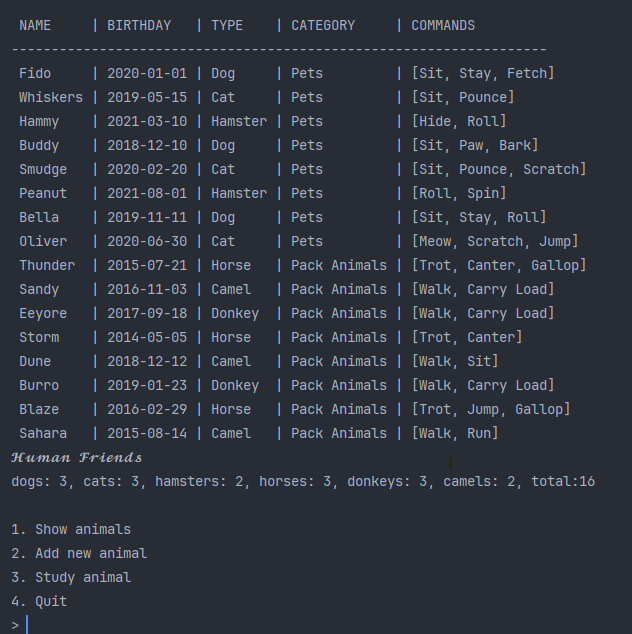

1. ООП и Java
   - Создать иерархию классов в Java, который будет повторять диаграмму классов созданную в задаче 6(Диаграмма классов) .

2. Программа-реестр домашних животных
    - Написать программу на Java, которая будет имитировать реестр домашних животных. 
    - Должен быть реализован следующий функционал:   
      - Добавление нового животного
          - Реализовать функциональность для добавления новых животных в реестр.       
          Животное должно определяться в правильный класс (например, "собака", "кошка", "хомяк" и т.д.)        
      - Список команд животного
          - Вывести список команд, которые может выполнять добавленное животное (например, "сидеть", "лежать").        
      - Обучение новым командам
          - Добавить возможность обучать животных новым командам.
      - Вывести список животных по дате рождения
      - Навигация по меню
          - Реализовать консольный пользовательский интерфейс с меню для навигации между вышеуказанными функциями.
        
3.  Счетчик животных
    - Создать механизм, который позволяет вывести на экран общее количество созданных животных любого типа (Как домашних, так и вьючных), то есть при создании каждого нового животного счетчик увеличивается на “1”. 

